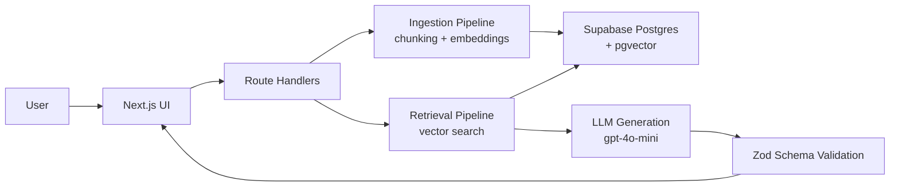
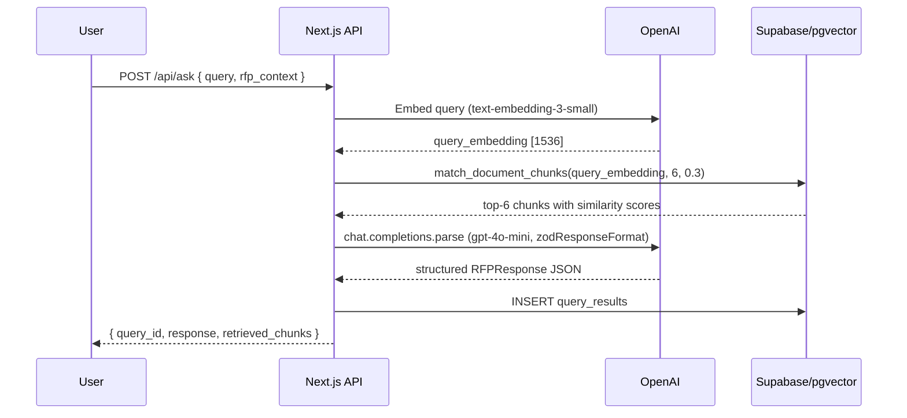

# AI RFP / Enterprise Knowledge Agent

> Draft RFP responses grounded in your internal knowledge base — with source citations, confidence scoring, and missing information flags.

---

## Why I built this

Answering RFPs and proposal questions is one of the most time-consuming things a B2B team does. The knowledge you need already exists somewhere — a case study, a security note, an implementation playbook — but pulling it together under deadline pressure is painful. Generic AI tools make it worse because they invent answers, and in enterprise sales that gets you into trouble fast.

This project is my attempt to build what that workflow should actually look like: a structured retrieval and generation pipeline where every claim is grounded in a source document, every gap is flagged explicitly, and the output is ready to drop into a proposal without second-guessing whether the AI made something up.

---

## What it does

You load your knowledge base (case studies, security docs, implementation guides, answer libraries). You ask a question. It finds the most relevant content, generates a structured response in enterprise proposal style, and shows you exactly where every claim came from.

```
Your question
  → embed with text-embedding-3-small
  → cosine similarity search across all indexed chunks (pgvector)
  → top 6 chunks retrieved
  → gpt-4o-mini generates structured response (Zod-validated JSON)
  → response includes:
      draft answer · executive summary · supporting evidence
      source citations · missing info flags · confidence level · next actions
```

---

## Architecture





---

## Tech stack

| Layer | Technology |
|-------|-----------|
| Framework | Next.js 16 (App Router) + TypeScript |
| Styling | Tailwind CSS v4 |
| Database | Supabase Postgres + pgvector |
| Embeddings | OpenAI text-embedding-3-small (1536 dims) |
| Generation | OpenAI gpt-4o-mini with structured output |
| Schema validation | Zod v4 (end-to-end typed) |
| Testing | Vitest |
| Deployment | Vercel + Supabase Cloud |

---

## Features

- **Markdown-aware chunking** — documents split on `##` section boundaries, each chunk prefixed with `[Document > Section]` for better embedding quality and cleaner citations
- **One-click sample dataset** — 8 realistic enterprise documents loaded with a single button; useful for seeing the system work before you connect your own content
- **Semantic search** — pgvector cosine similarity over all indexed chunks, threshold-filtered to avoid low-quality retrievals
- **Structured generation** — gpt-4o-mini with a Zod schema as the response format, so the type flows from the database straight to the UI with no manual parsing
- **Source citations** — every key claim links to the source document, chunk content, and similarity score
- **Missing information flags** — explicit acknowledgement of what isn't covered, with a suggested owner for each gap
- **Confidence levels** — high/medium/low with a plain-English reason, grounded in how well the retrieved content actually answers the question
- **Copy as markdown** — exports the full response with citations in one click

---

## What it won't do

- Invent facts, metrics, customer names, or certifications that aren't in your documents
- Make decisions for you — outputs are drafts for human review
- Replace a subject-matter expert — it pulls together what you have, it doesn't know what you don't

---

## Setup

### Prerequisites

- Node.js 20+
- A Supabase project (free tier is fine)
- An OpenAI API key

### 1. Clone and install

```bash
git clone https://github.com/georget-j/ai-rfp-agent.git
cd ai-rfp-agent
npm install
```

### 2. Environment variables

```bash
cp .env.example .env.local
```

Fill in `.env.local`:

```
OPENAI_API_KEY=sk-...
NEXT_PUBLIC_SUPABASE_URL=https://your-project.supabase.co
NEXT_PUBLIC_SUPABASE_ANON_KEY=eyJ...
SUPABASE_SERVICE_ROLE_KEY=eyJ...
```

### 3. Database setup

Run the three migration files in your Supabase project's SQL editor, in order:

1. `supabase/migrations/001_enable_vector.sql` — enables the pgvector extension
2. `supabase/migrations/002_create_tables.sql` — creates the documents, chunks, queries, and results tables
3. `supabase/migrations/003_match_function.sql` — creates the `match_document_chunks` SQL function

### 4. Run locally

```bash
npm run dev
```

Open [http://localhost:3000](http://localhost:3000).

### 5. Load sample data

Click **"Load Sample Documents"** on the dashboard. It ingests 8 sample enterprise documents, chunks them, generates embeddings, and stores everything in Supabase.

> This makes roughly 8 batched embedding API calls — total cost is under $0.01.

---

## Environment variables

| Variable | Description |
|----------|-------------|
| `OPENAI_API_KEY` | OpenAI API key — server-side only, never sent to the browser |
| `NEXT_PUBLIC_SUPABASE_URL` | Supabase project URL |
| `NEXT_PUBLIC_SUPABASE_ANON_KEY` | Supabase anon/public key |
| `SUPABASE_SERVICE_ROLE_KEY` | Supabase service role key — server-side only |

---

## Example questions to try

After loading the sample documents:

1. *"Draft a response to a fintech customer asking how we reduce AML review time."*
2. *"Do we have SOC 2 certification? What's our current compliance status?"*
3. *"Which case studies are relevant to a legaltech workflow automation pitch?"*
4. *"What does our standard implementation timeline look like, and what do we need from the customer?"*
5. *"Can this platform help with hospital staffing optimisation?"* — off-topic test, should return low confidence with no invented healthcare capabilities

---

## Tests

```bash
npm test
```

42 unit tests across three files:

- **chunking** — size bounds, section boundary detection, context prefix format, long-section splitting, plain-text fallback, empty input
- **prompt construction** — system prompt constraints, chunk injection, optional RFP context fields
- **schema validation** — Zod types for RFPResponse and AskRequest, invalid enum rejection

---

## How chunking works

Documents are split on `##` and `###` headings. Each section becomes a chunk (or several if it's long), prefixed with `[Document Title > Section Name]`. This keeps semantically related content together and gives the embedding model a clear topic signal rather than arbitrary character slices.

For plain text documents without headers, it falls back to paragraph/sentence boundary splitting with 150-character overlap.

The `[Title > Section]` prefix also shows up in citations, so when the LLM says it found something in "Implementation Playbook > Discovery Phase", you can go find that section directly.

---

## Evaluation

See [/docs/evaluation.md](./docs/evaluation.md) for test cases, expected retrieval behaviour, pass/fail criteria, known failure modes, and suggested improvements.

I've included this because I think the difference between a demo that looks good and a system you'd trust in production is largely about knowing where it breaks.

---

## Known limitations

- **PDF not supported** — text and markdown only in this version
- **No auth** — single-user demo, no workspace isolation
- **Synchronous ingestion** — large document batches may time out; background jobs would be the production fix
- **Vector-only search** — no keyword fallback; hybrid search (pgvector + full-text) would improve recall for exact-match queries
- **Citation verification not implemented** — the model is instructed to cite only retrieved chunks but this isn't server-verified

---

## Deploying

The project is set up for Vercel + Supabase:

1. Push to GitHub
2. Import to Vercel — Next.js is auto-detected
3. Add the four environment variables in Vercel project settings
4. Run the SQL migrations in your Supabase SQL editor

---

## What this demonstrates

A complete RAG pipeline in TypeScript: document ingestion → markdown-aware chunking → batch embeddings → pgvector similarity search → structured gpt-4o-mini generation → Zod-validated typed response from database to UI.

The design choices I'd highlight for a technical conversation:
- **Zod as the OpenAI response format** rather than a separate JSON schema — one source of truth, types flow all the way through
- **SQL-native vector search** via pgvector rather than a separate vector database — simpler ops, joins work normally, no sync issues
- **Explicit missing information** in the response schema — the model is forced to surface gaps rather than paper over them
- **Section-aware chunking** — keeps the embedding meaningful and makes citations navigable

---

## Security note

Don't upload confidential documents to a public deployment. Documents are stored as plain text in Supabase with no access controls beyond the service role key. Add Supabase RLS before any multi-user deployment.

---

*George Terpitsas — [github.com/georget-j](https://github.com/georget-j) — georgeterpitsas1@hotmail.co.uk*
